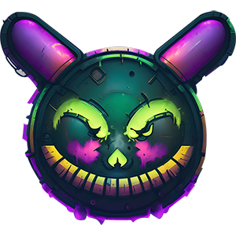
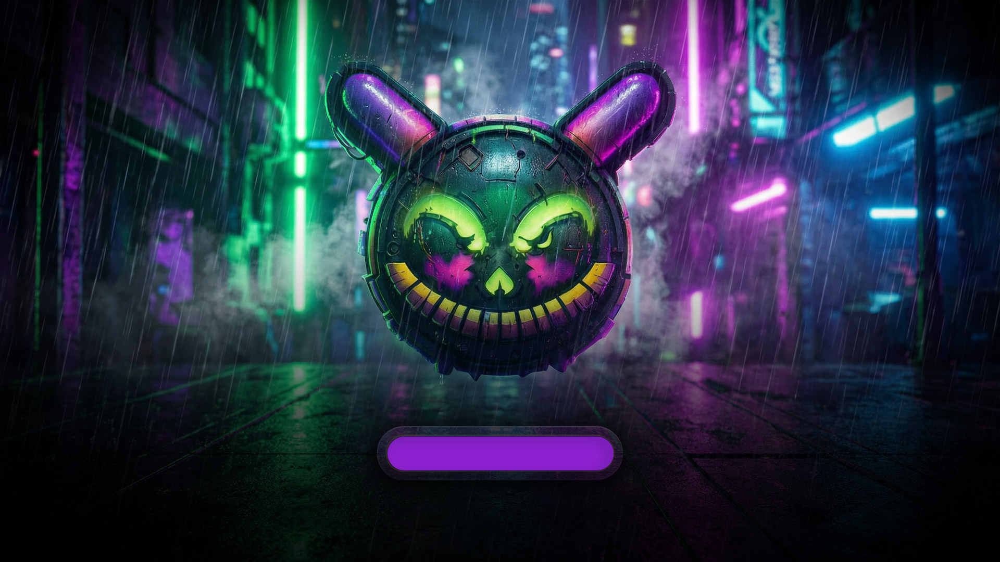
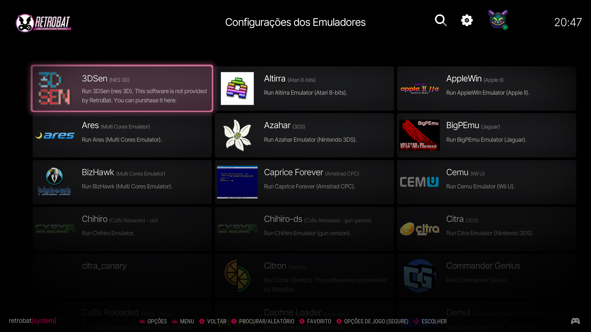
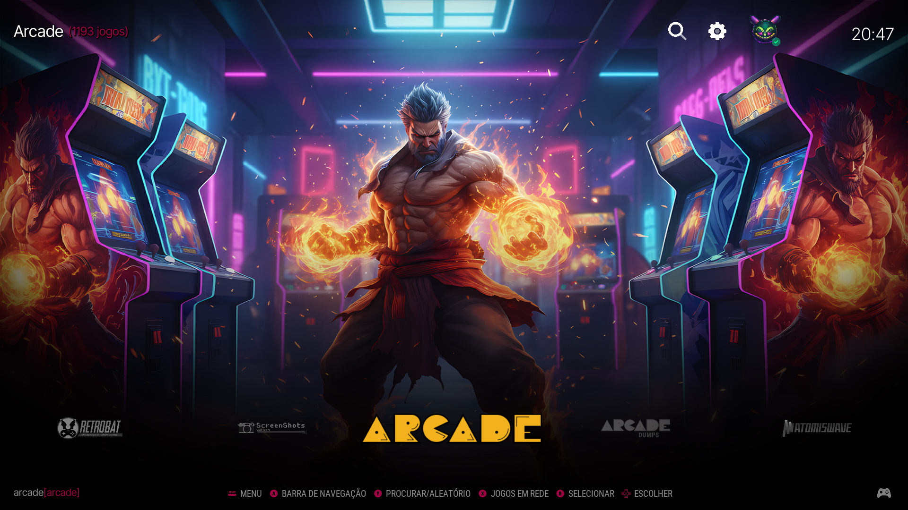
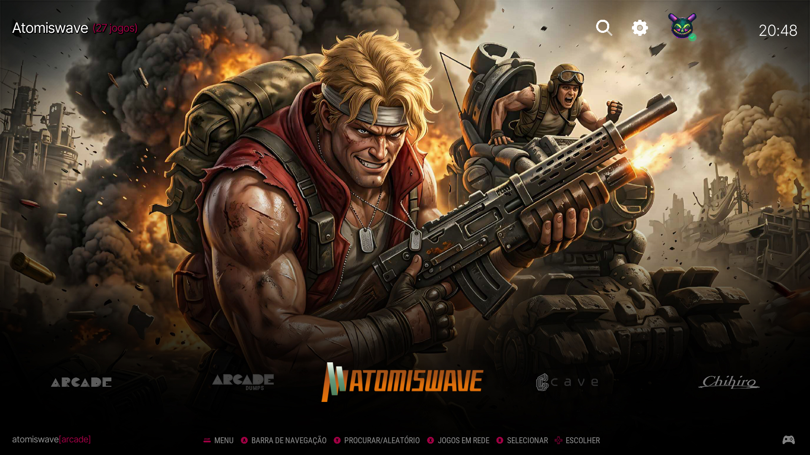
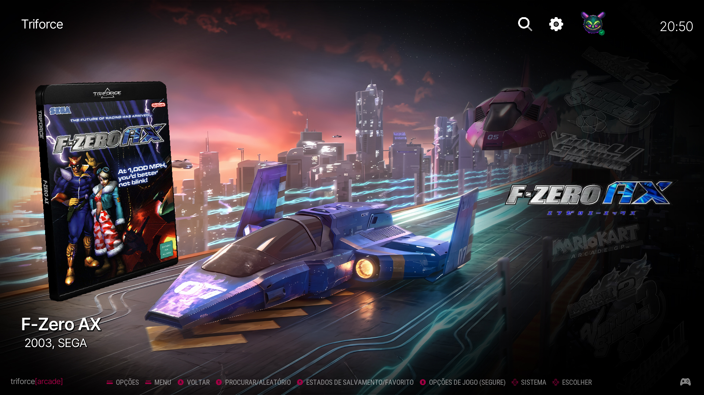
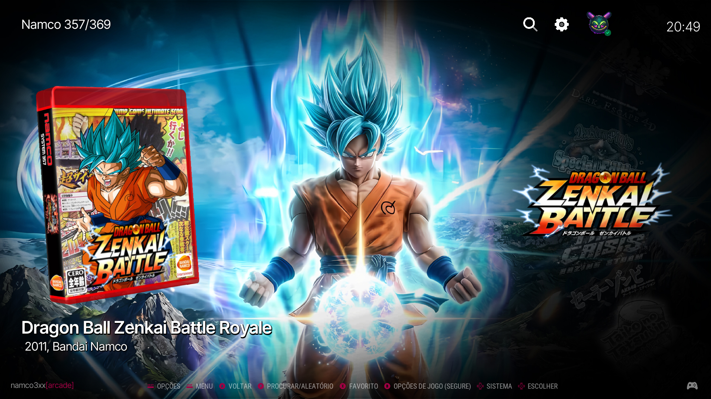

# RIESCADE Origins

Theme 'RIESCADE' Origins

for use with RetroBat (https://www.retrobat.org) and Batocera V42+ (https://batocera.linux)

## Installation

To clone this repository, use the following command:

```cmd
git clone https://github.com/marcoriesco/riescade_origins.git
```

## License

Summary of the license below:

ALLOWED: - Share and duplicate as it is - Edit, alter, change it

REQUIREMENTS: - Attribution, give credit to the creator - Indicate changes to it - Publish the changes under the same license

PROHIBITED: - Commercial distribution

---

LOGO AND BACKGROUNDS NOTICE

The used logos and trademarks are copyright of their respective owners.

Midjourney, Nano Banana backgrounds use is restricted to this template.

## Screenshots













## Credits

- [Google Fonts](https://fonts.google.com/specimen/Open+Sans)
- [Backgrounds Arcade CoinOps (modified 16:9 by Photoshop A.I)](https://discord.com/invite/q7uaBDM6GS)
- [Emulators Template (Retrobat)](https://github.com/fabricecaruso/es-theme-carbon)

# riescade_origins
